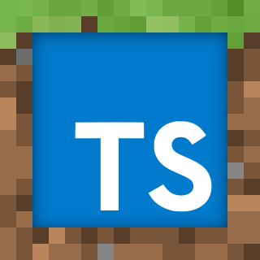

# TS-MC 

A minecraft clone with TypeScript and Three.js


## Installation
Make sure Node and npm is installed
```bash
npm install npm@latest -g
npm install -g typescript
```
1. Clone repository
```bash
git clone https://github.com/CuddlyBunion341/ts-mc.git
```
2. Install npm dependencies
```bash
npm install
```
3. Run the development server
```bash
npm run dev
```

## License
Distributed under the MIT License. See [LICENSE](LICENSE) for further information.